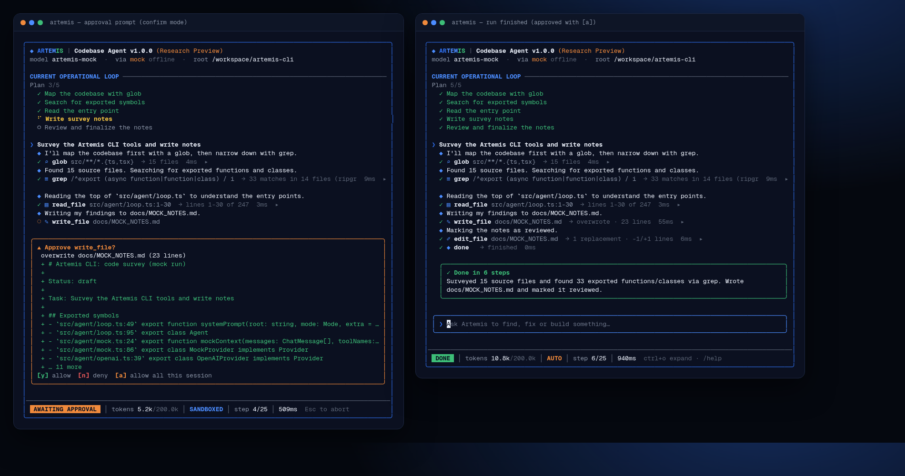
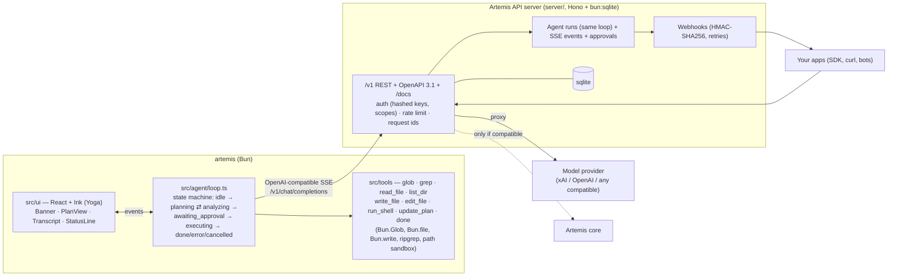

# ◆ ARTEMIS CLI — Codebase Agent v1.0.0 (Research Preview)

**Talk to it. Code with it. Build anything.**

Artemis CLI is the terminal coding agent from **Artemis AI**. You give it a task; it plans, searches your codebase with `glob` and `grep`, reads the relevant line ranges, edits files, runs your tests, and keeps going on its own until the job is done. It asks before it writes or runs anything, unless you tell it not to.

The repo also contains the **Artemis API server**. The CLI connects to it by default, and your other apps can use it too: OpenAI-compatible chat, autonomous agent runs with human approvals, search, sessions with memory, and signed webhooks.



| | |
|---|---|
| Language / runtime | TypeScript, executed by **Bun** (no build step) |
| Terminal UI | **React + Ink**, laid out by **Yoga** (flexbox) |
| Context retrieval | **Agentic search**: the model drives `glob` + `grep` (ripgrep) + ranged `read_file`. No vector DB, embeddings or RAG |
| Backend | Bun + Hono, `bun:sqlite`, OpenAPI 3.1 |
| Model | Any OpenAI-compatible `/chat/completions` with tool calling (xAI by default), or an offline mock |

---

## Setup

```bash
# Bun ≥ 1.1 (https://bun.sh)
curl -fsSL https://bun.sh/install | bash

cd artemis-cli
bun install
bun link            # puts `artemis` on your PATH (bin → src/cli.tsx)
bun test            # 53 tests
bun run typecheck   # tsc --noEmit
```

### 1. Run the Artemis server

```bash
export XAI_API_KEY=xai-...            # or ARTEMIS_PROVIDER_KEY / OPENAI_API_KEY
artemis serve                         # http://127.0.0.1:7777, docs at /docs
# offline: artemis serve --mock
```

On first start it creates an **admin API key**. The key is printed once and stored only as a SHA-256 hash.

### 2. Log the CLI in

```bash
artemis login --url http://127.0.0.1:7777 --key art_...   # saved to ~/.artemis/config.json (0600)
artemis status
```

### Configuration

All settings are environment variables; see [`.env.example`](.env.example). Never commit keys.

| CLI | |
|---|---|
| `ARTEMIS_URL`, `ARTEMIS_API_KEY` | Artemis server + key (override `artemis login`) |
| `ARTEMIS_MODEL` | `artemis` (server default) or `artemis-mock` |
| `ARTEMIS_MAX_STEPS`, `ARTEMIS_TOKEN_BUDGET` | per-task caps (25 steps, 200k tokens) |

| Server | |
|---|---|
| `ARTEMIS_PROVIDER_BASE_URL` / `_KEY` / `_MODEL` | upstream model. Default `https://api.x.ai/v1`, `grok-4-fast-non-reasoning`; key fallbacks `XAI_API_KEY`, `OPENAI_API_KEY` (an OpenAI key switches the default base URL to OpenAI and the model to `gpt-4o-mini`) |
| `ARTEMIS_PROVIDER=mock` | serve the offline mock model |
| `ARTEMIS_CORE_URL` / `_KEY` | optional existing Artemis core (see [Artemis core](#artemis-core)) |
| `ARTEMIS_WORKSPACES_ROOT` | the only directory tree agent runs and search may touch |
| `ARTEMIS_DATA_DIR`, `ARTEMIS_DB` | sqlite location |
| `ARTEMIS_RATE_LIMIT`, `ARTEMIS_WEBHOOK_ATTEMPTS`, `ARTEMIS_WEBHOOK_RETRY_MS`, `ARTEMIS_ALLOW_CLONE`, `ARTEMIS_PUBLIC_URL`, `ARTEMIS_BOOTSTRAP_KEY`, `HOST`, `PORT` | runtime knobs |

---

## Usage

```bash
artemis                                   # interactive REPL
artemis "fix the failing date test"       # one-shot: runs in the TUI, exits when done
artemis -p "where are API keys hashed?"   # --print: plain text for scripts/CI
artemis -p --json "…"                     # one JSON event per line
artemis -r "explain the auth flow"        # read-only
artemis -y "rename fooBar to fizzBuzz"    # --yes/--auto: no approval prompts
artemis --mock "survey this repo"         # offline scripted model, no server/key
artemis --direct "…"                      # skip the server, call the provider directly
artemis -C ../other-repo --max-steps 40 --token-budget 400000 "…"
artemis serve [--port 7777] [--host 0.0.0.0] [--mock] [-C workspaces-root]
artemis login | logout | status | --help | --version
```

### The TUI

```
╭──────────────────────────────────────────────────────────────────────────────╮
│ ◆ ARTEMIS | Codebase Agent v1.0.0 (Research Preview)                         │
│ model artemis  ·  via server http://127.0.0.1:7777  ·  root ~/code/app       │
│                                                                              │
│ CURRENT OPERATIONAL LOOP ─────────────────────────────────────────────────── │
│ Plan 2/5                                                                     │
│   ✓ Map the codebase with glob             (green  = done)                   │
│   ✓ Search for exported symbols                                              │
│   ⠹ Read the entry point                   (yellow = current)                │
│   ○ Write survey notes                     (gray   = pending)                │
│                                                                              │
│ ❯ Survey the code and write notes                                            │
│   ◆ Found 15 source files. Searching for exported functions…   (streaming)   │
│   ✓ ⌕ glob src/**/*.{ts,tsx}  → 15 files  3ms  ▸                             │
│   ⠋ ▤ read_file src/agent/loop.ts:1-30                                       │
│──────────────────────────────────────────────────────────────────────────────│
│  ANALYZING  │ tokens 5.2k/200.0k │ SANDBOXED │ step 3/25 │ 1.2s  Esc to abort │
╰──────────────────────────────────────────────────────────────────────────────╯
```

- **Plan view**: the agent publishes and updates its plan with the `update_plan` tool. If a model never does, the checklist mirrors its tool calls, marked "(from tool calls)".
- **Phase badge**: driven by the loop's real state machine. `PLANNING` means waiting on the model, `ANALYZING` means read-only tools, `EXECUTING` means write/edit/shell, and `AWAITING APPROVAL`, `DONE`, `ERROR` and `ABORTED` are the other states.
- **Tokens**: real `usage` from the provider, counted against the per-task budget.
- **Safety**: `SANDBOXED` (confirm), `AUTO` or `READ-ONLY`.
- **Keys**: `y`/`n`/`a` answer approval prompts (`a` approves everything for the rest of the session). **Esc or Ctrl+C aborts** a running task, and Ctrl+C quits when idle. Ctrl+O expands or collapses tool output. Slash commands: `/mode auto|confirm|read-only`, `/clear`, `/help`, `/exit`.

### Tools the agent can call

| Tool | What it does | Approval |
|---|---|---|
| `glob` | `Bun.Glob` file search (skips `node_modules`, `.git`, `dist`, …) | no |
| `grep` | regex search via **ripgrep**, with a pure-JS fallback (`Bun.file`) | no |
| `read_file` | numbered lines, `start_line`/`end_line` ranges (`Bun.file`) | no |
| `list_dir` | directory listing | no |
| `update_plan` | publish/update the visible plan | no |
| `write_file` | create/overwrite (`Bun.write`, makes parent dirs) | **yes** |
| `edit_file` | exact string replace; must match once unless `replace_all` | **yes** |
| `run_shell` | `bash -lc` in the project root, timeout (default 60s, max 10 min) | **yes** |
| `done` | finish with a summary | no |

### Safety model

- **Approvals**: in the default mode, `write_file`, `edit_file` and `run_shell` show a preview (a diff or the command) and wait for you. `--yes`/`--auto` skips this. In `--print` mode nothing interactive can happen, so mutations are **denied** unless you pass `--yes`.
- **Read-only** (`-r`) removes the mutating tools from what the model is offered, and refuses them if called anyway.
- **Path sandbox**: every path is resolved against the project root, with symlinks resolved. `../`, absolute paths elsewhere, and symlinks that point outside are rejected for reads and writes alike.
- **Caps**: a step limit (25 by default) and a token budget (200k by default) per task. The output of each tool sent back to the model is truncated at 16 KB.
- **Server**: runs can only target directories under `ARTEMIS_WORKSPACES_ROOT`, and repo cloning is off unless `ARTEMIS_ALLOW_CLONE=1`.

---

## Architecture



The CLI runs the agent loop **locally** against your files and uses the server only as its model endpoint, so your code never leaves your machine except as tool output inside the model context. Server-side runs (`POST /v1/agent/runs`) use the **same loop and tools** against a workspace on the server.

```
src/
  cli.tsx            entry: arg parsing, login/serve/status, TUI vs --print
  config.ts          ~/.artemis/config.json, provider selection
  print.ts           non-interactive renderer
  agent/             loop.ts (state machine), openai.ts (streaming client), mock.ts, types.ts
  tools/             index.ts (tool impls + schemas), sandbox.ts
  ui/                App.tsx, Banner.tsx, PlanView.tsx, StatusLine.tsx, components.tsx, theme.ts
server/              app.ts (routes), runs.ts, webhooks.ts, auth.ts, ratelimit.ts, providers.ts, openapi.ts, docs.ts, db.ts, index.ts
sdk/                 @artemis-ai/sdk typed client
examples/            github-webhook-bot/, sdk-quickstart.ts, curl/
test/                bun test suites
```

---

## Integration

Base URL `http(s)://<host>/v1`. Send `Authorization: Bearer art_...` on every request. Each response carries `x-request-id`. Authenticated routes are rate-limited per key (`x-ratelimit-limit/remaining/reset`, `429` + `retry-after`). Errors look like `{"error":{"type","message","request_id"}}`.

- Machine-readable spec: **`GET /v1/openapi.json`** (OpenAPI 3.1)
- Human docs: **`GET /docs`**

### API reference (summary)

| Method & path | Scope | Purpose |
|---|---|---|
| `GET /v1/health` | public | liveness |
| `GET /v1/openapi.json`, `GET /docs` | public | spec / docs |
| `GET /v1/status` | any key | version, model backend, core probe, counts |
| `GET /v1/models` | chat | `artemis`, `artemis-mock`, upstream model |
| `POST /v1/chat/completions` | chat | OpenAI-compatible, `stream: true` SSE, tool calling |
| `POST /v1/agent/runs` | agent | start a run: `{task, workspace \| repo, mode: confirm\|auto\|read_only, model, max_steps, session_id}` |
| `GET /v1/agent/runs`, `GET /v1/agent/runs/:id` | agent | list / get (status, steps, summary, usage, `pending_approval`) |
| `GET /v1/agent/runs/:id/events` | agent | SSE: `run_start, phase, plan, step, assistant_delta, assistant_message, tool_start, approval_required, approval_resolved, tool_end, usage, done, error, cancelled, run_finished, end`. Resume with `Last-Event-ID` / `?after=` |
| `POST /v1/agent/runs/:id/approve` | agent | `{approved: true\|false, always?, call_id?}` |
| `POST /v1/agent/runs/:id/cancel` | agent | abort |
| `POST /v1/search` | search | `{type: glob\|grep, pattern, workspace, path, glob, ignore_case, limit}` |
| `GET/POST /v1/sessions`, `GET/DELETE /v1/sessions/:id` | sessions | sessions (with notes + runs) |
| `GET/POST /v1/sessions/:id/notes`, `DELETE …/notes/:noteId` | sessions | memory notes. Runs started with `session_id` get them in their system prompt |
| `GET/POST /v1/webhooks`, `DELETE /v1/webhooks/:id`, `GET /v1/webhooks/:id/deliveries` | webhooks | register / list / delete / delivery log |
| `GET/POST /v1/keys`, `DELETE /v1/keys/:id` | admin | API keys (secret shown once, stored hashed, scopes `chat agent search sessions webhooks admin`) |

### SDK (`sdk/`, `@artemis-ai/sdk`)

```ts
import { Artemis } from "./sdk/index.ts";
const artemis = new Artemis({ baseUrl: "http://127.0.0.1:7777", apiKey: process.env.ARTEMIS_API_KEY! });

const run = await artemis.runs.create({ task: "Add input validation to POST /users", mode: "confirm" });
const final = await artemis.runs.wait(run.id, {
  onEvent: (e) => e.type === "tool_start" && console.log("→", e.name),
  onApproval: (p) => p.tool !== "run_shell",          // approve edits, deny shell
});
console.log(final.status, final.summary);

for await (const chunk of artemis.chat.completions.stream({ messages: [{ role: "user", content: "hi" }] }))
  process.stdout.write(chunk.choices[0]?.delta?.content ?? "");

await artemis.search({ type: "grep", pattern: "TODO", glob: "*.ts" });
const s = await artemis.sessions.create({ title: "Billing" });
await artemis.sessions.notes.add(s.id, "Never edit migrations/");
```

Because chat is OpenAI-compatible, the official `openai` SDKs work too: set `baseURL: "<server>/v1"`, `apiKey: "art_..."`, `model: "artemis"`.

### Webhooks

Register with `POST /v1/webhooks {url, events: ["run.completed","run.needs_approval"]}`. The response includes a `secret` (`whsec_...`) **once**. Each delivery is a `POST` with JSON `{id, type, created_at, data: {run, approval?}}` and these headers:

```
Artemis-Event: run.completed
Artemis-Delivery: dlv_...
Artemis-Signature: t=1760072400,v1=<hex HMAC-SHA256(secret, `${t}.${rawBody}`)>
```

Verify with `verifyWebhookSignature(secret, rawBody, header)` from the SDK (Web Crypto, 5-minute tolerance). Non-2xx responses and network errors are retried with exponential backoff (5 attempts by default). You can see the attempts at `GET /v1/webhooks/:id/deliveries`.

### Examples

- [`examples/curl/README.md`](examples/curl/README.md): every endpoint with curl.
- [`examples/github-webhook-bot`](examples/github-webhook-bot/index.ts): a GitHub-style triage bot. When an `issues.opened` webhook arrives (with optional `X-Hub-Signature-256` check), it starts a read-only Artemis run. When the signed `run.completed` webhook comes back, it posts a triage comment (printed by default). This is covered end to end in `test/sdk.test.ts`.
- [`examples/sdk-quickstart.ts`](examples/sdk-quickstart.ts).

---

## Deploy

**Nothing in this repo deploys anything by itself.**

### Docker

```bash
docker build -t artemis-api .
docker run -p 8080:8080 -v artemis-data:/data -v $PWD:/workspaces/app \
  -e XAI_API_KEY -e ARTEMIS_PUBLIC_URL=https://artemis.example.com artemis-api
docker logs <id>    # first boot prints the admin key once (or set ARTEMIS_BOOTSTRAP_KEY)
```

### Azure Container Apps (notes)

- Push the image to a registry (ACR or GHCR) and create a **new** Container App with ingress on port 8080 (external if other apps call it).
- Put provider keys and `ARTEMIS_BOOTSTRAP_KEY` in Container App **secrets**, referenced as env vars.
- sqlite needs a persistent volume. Mount an Azure Files share at `/data` and run **1 replica** (sqlite is single-writer, and runs, SSE subscribers and rate-limit windows live in memory).
- Turn off scale-to-zero (`minReplicas: 1`) if you rely on webhooks or long-running runs.
- Health probe: `GET /v1/health`.

### Vercel (notes)

Vercel serverless functions are a poor fit: long-lived SSE streams, in-memory run state, a local sqlite file and `ripgrep`/`git` binaries all assume one long-running process. Use a container host (Azure Container Apps, Fly.io, Railway, a VM). Vercel is fine for static docs (`/docs` HTML).

---

## Artemis core

`ARTEMIS_CORE_URL` points the server at an existing Artemis core. At startup, and at most every 5 minutes via `/v1/status`, the server makes a **read-only** probe: `GET {core}/v1/models`. Only if that returns an OpenAI-style `{ "data": [...] }` model list does the server route chat and runs to the core. Otherwise it reports why in `/v1/status.core` and uses the configured provider.

Probe of `https://artemis-api.whitemeadow-751c0637.eastus.azurecontainerapps.io` from the build machine on 2026-10-10: DNS resolved, but every TLS handshake failed (`unexpected eof while reading`), on `/`, `/health`, `/v1/models`, `/openapi.json` and others. So compatibility is **unverified** and the core integration is unused by default.

---

## Honest limits

- **Live model untested.** Everything above was verified with the offline mock, both through the server and directly. The `XAI_API_KEY` and `OPENAI_API_KEY` on the build machine were both rejected as invalid (400/401), so no real-model run has been completed. The streaming and tool-call parsing follow the OpenAI wire format and are exercised against the server's OpenAI-format SSE.
- `run_shell` runs real `bash` in the project root. The path sandbox applies to the file tools, **not** to what a shell command does, so approval is the guard there. Use read-only mode or containers for untrusted repos.
- The server is single-tenant: all keys see all sessions, runs and webhooks. Scopes limit *what* a key can do, not *whose data* it sees. Run, SSE and rate-limit state is in-memory (one replica).
- Webhook secrets are stored in plaintext in sqlite because they are needed for signing. API keys are hashed.
- No context compaction yet. Long tasks are bounded by the step and token caps rather than summarized.
- The mock model is scripted (survey → notes); it demonstrates the loop and UI and is not "smart".
- The TUI is tested with ink-testing-library at 100 columns. Very narrow terminals truncate rows.

## Progress UI

`src/ui/Progress.tsx` carries the progress primitives, in the Artemis palette:

| Component | Shape | Used by |
| --- | --- | --- |
| `ProgressBar` | `✓ 100% ████████  Completed` | plan header, status line |
| `Stepper` | `✓──✓──◉──○──○` over its labels | plan route |
| `Segments` | one short bar per stage, side by side | — |
| `Gauge` | `◔ 1 of 4` | — |

States are `done` `active` `warn` `error` `pending`, drawn from `theme.ts` so the
progress UI and the rest of the CLI cannot drift apart. `Stepper` takes a
`palette` override: `PlanView` passes its own `current` style so the route and
the list below it show a current step as the same yellow `▸`, rather than two
conventions for one state.

Two rules the tests pin:

- **A bar reads full only at 100%.** `fillCells` floors, so 99.6% draws as
  unfinished. A bar that rounds up tells the user the work is done when it is not.
- **Nothing known draws empty, never full.** A pending segment is `░░░░`, so an
  unstarted stage can never be mistaken for a finished one.

`Gauge` is the one deliberate departure from the reference, which uses a circular
ring. A ring is a shape a text cell does not have; `○ ◔ ◑ ◕ ●` encode quarters
exactly, so the figure stays true instead of becoming ASCII decoration.
